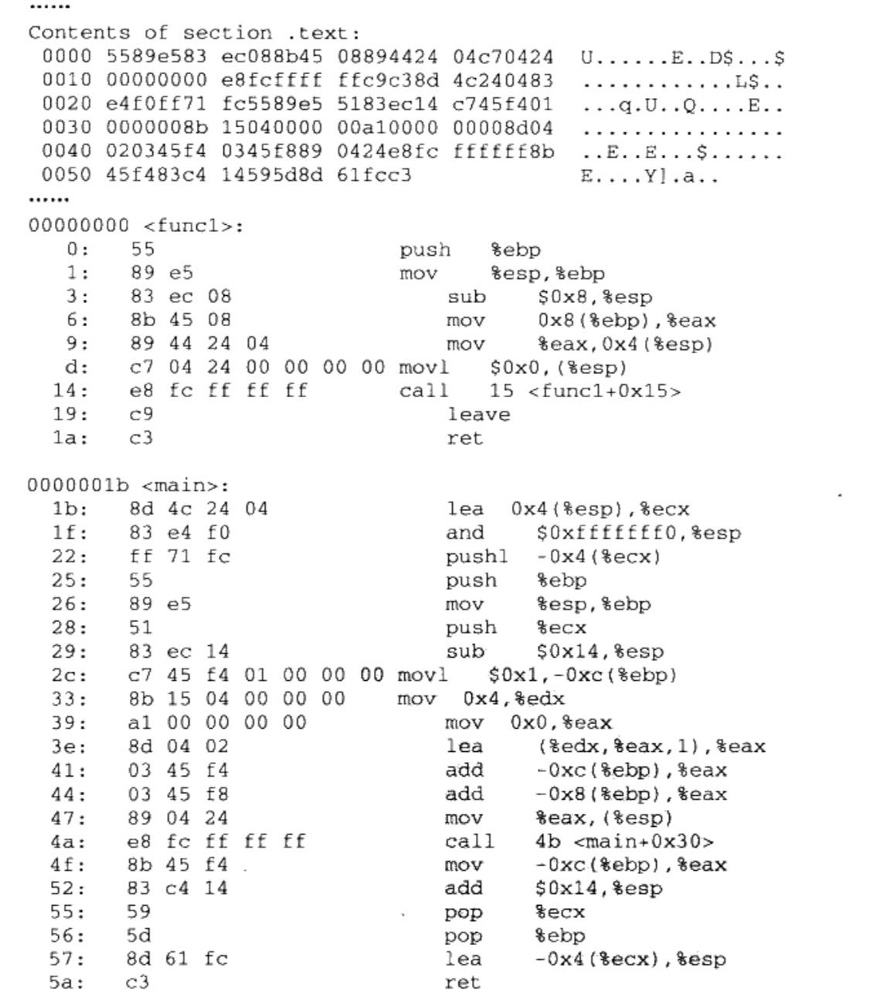
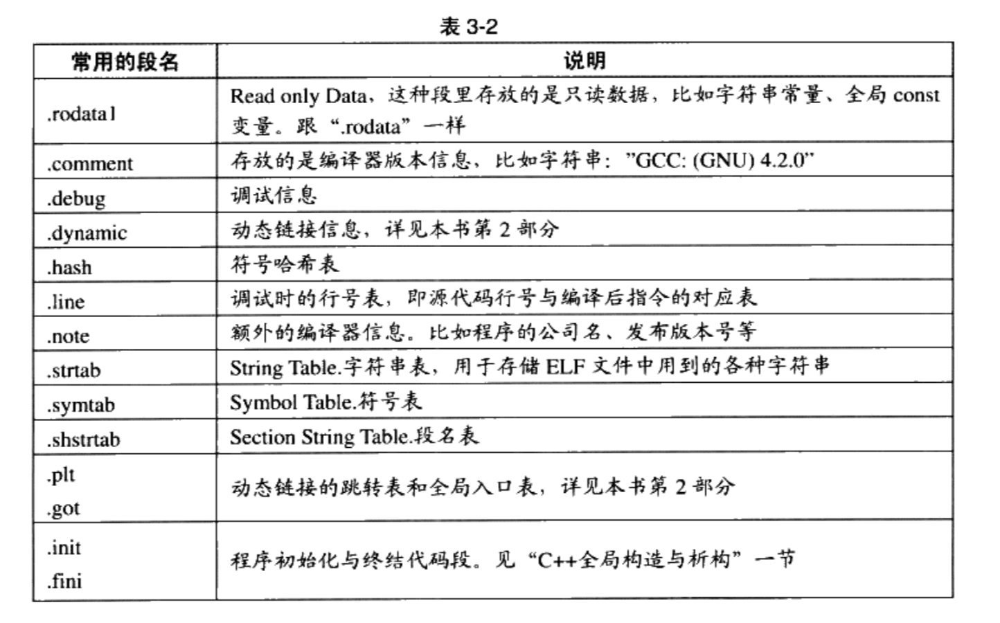

目标文件里有什么

1. 目标文件从结构上讲,它是已经编译后的可执行文件格式,只是还没有经过链接的过程其中可能有些符号或有些地址还没有被调整
2. 目标文件本身就是按照可执行文件格式存储的,只是跟真正的可执行文件在结构上稍有不同
3. 可执行文件格式涵盖了程序的编译、链接、装载和执行的各个方面
4. 从广义上看,目标文件与可执行文件的格式其实几乎是一样的,所以我们可以广义地将日标文件与可执行文件看成是一种类型的文件,在 Windows下,我们可以统称它们为 PE-COFF文件格式， 在 Linux下,我们可以将它们统称为ELF文件

###3.1 目标文件的格式

1. 可执行文件格式( Executable)主要是 Windows下的PE( Portable Executable)和 Linux的ELF( Executable Linkable format),它们都是**COFF( Common file format)格式的变种**。

2. COFF的主要贡献是在目标文件里面引入了“段”的机制,不同的目标文件可以拥有

   不同数量及不同类型的“段"。另外,它还定义了调试数据格式

3. 目标文件就是源代码编译后但未进行链接的那些中间文件( Windows

   的ob和 Linux下的.o)

4. 按可执行文件格式存储:

   1. 可执行文件( Windows的exe和 Linux下的ELF可执行文件)
   2. 动态链接库(DLL, Dynamic Linking Library)( Windows的d和 Linux的.so)
   3. 静态链接库( Static Linking Library)( Windows的lib和 Linux的a)文件

5. 静态链接库稍有不同,它是把很多目标文件捆绑在一起形成一个文件,再加上一些索引,可以简单理解为一个包含有很多目标文件的文件包

6. 采用ELF格式的文件类型

   

   

###  3.2 目标文件是什么样的

1. 目标文件内的内容:
   1. 编译后的机器指令代码、数据
   2. 链接时所须要的一些信息,比如符号表、调试信息、字符串等

2. 一般目标文件将这些信息按不同的属性,以“节”( Section)的形式存储,有时候

   也叫“段”( Segment)。

3. 简单的目标文件结构

   

   + ELF文件的开头是一个“文件头”,它描述了整个文件的文件属性

     ```
     1. 包括文件是否可执行、是静态链接还是动态链接及入口地址(如果是叮执行文件)、目标硬件、目标操作系统等信息
     2. 文件头还包括个段表( Section Table),段表其实是一个描述文件中各个段的数组
     3. 段表描述了文件中各个段在文件中的偏移位置及段的属性等,从段表里面可以得到每个段的所有信息
     4. 文件头后面就是各个段的内容,比如代码段保存的就是程序的指令,数据段保存的就是程序的静态变量等
     ```

   + 程序源代码编译后的机器指令经常被放在代码段( Code Section)里,代码段常见的名字有“.code”或“.text”

   + 已经初始化的全局变量和局部静态变量数据经常放在数据段( Data Section),数据段的一般名字都叫“.data”

   + 未初始化的全局变量和局部静态变量数据经常放在.bss段, 只是为未初始化的全局变量和局部静态变量预留位置而已,它并没有内容,所以它在文件中

     也不占据空间

     ```
     
     ```
   1. 我们知道未初始化的全局变量和局部静态变量默认值都为0,本来它们也可以被放在data段的但是因为它们都是0,所以为它们在data段分配空间
   并且存放数据0是没有必要的。
   2. 程序运行的时候它们的确是要占内存空间的,并且可执行文件必须记录所有未初始化的全局变量和局部静态变量的大小总和, 记为bss段
   3. Bss( Block Started by Symbol)最初用于定义符号并且为该符号预留给定数量的未初始化空间
     
     ```
     
     ```

4. 程序源代码被编译以后主要分成两种段:程序指令和程序数据。代码段属于

   程序指令,而数据段和.bss段属于程序数据

5. 将数据和指令分段存放的好处:

   1. 将数据置成可读写，将序的指令设置为只读，防止指令被改写

      ```
      当程序被装载后,数据和指令分别被映射到两个虚存区域。由于数据区域
      对于进程来说是可读写的,而指令区域对于进程来说是只读的,所以这两个虚存区
      域的权限可以被分别设置成可读写和只读。这样可以防止程序的指令被有意或无意地改写
      ```

   2. 程序的指令和数据被分开存放对CPU的缓存命中率提高有好处

      ```
      现代CPU的缓存一般都被设计成数据缓存和指令缓存分离,所以程序的指令和数据被分开存放对CPU的缓存命中率提高有好处。
      ```

   3. 如果系统中有多个副本时，将指令部分共享内存。

      ```
      如果系统中运行了数百个进程,可以想象共享的方法来节省大量空间
      ```


### 3.3 挖掘 SimpleSection.o

> 如不加说明, 则一下所有分析的都是32位的Intel x86平台的ELF格式

1. SimpleSection代码清单

   ```c
   int printf(const char *format, ...);
   int global_init_val = 84;
   int global_uninit_val;
   
   void func1(int i) {
      printf("%d\n",i);
   }
   
   int main(void) {
    static int static_var = 85;
    static int static_var2;
     int a = 1;
     int b ;
     func1(static_var + static_var2 + a+b);
     return a;
   }
   
   ```

   1. `$gcc -c Simplesection.c`得到目标文件`Simplesection.o`

      ```
      参数-c表示只编译不链接
      ```

   2. `$objdump -h Simplesection.o` 查看目标文件的结构和内容

      

      + readelf是linux下专门针对ELF文件格式的解析器

      + 参数“h”就是把ELF文件的各个段的基本信息打印出来

      + 上面的结果来看, SimpleSection.o的段包括了:

        1. 最基本的代码段(.text)
        2. 数据段(.data)
        3. BSS段(.bss)
        4. 只读数据段(.rodata)
        5. 注释信息段(.comment)
        6. 堆栈提示段(.note. GNU-stack)

      + 各种信息的含义

        1. Size: 段的长度(

        2. File offset:段所在的位置

        3. CONTENTS:表示该段在文件中存在

           ```
            1. BSS段没有“ CONTENTS”,表示它实际上在ELF文件中不存在
            2. "noe.GNU-Stack" 段虽然有"CONTENTS",但它的长度为0,这是个很古怪的段, 我们暂且忽略它,认为它在ELF文件中也不存在
           ```

        

   3. `$size SimpleSection.o` ，size命令用来查看ELF文件的代码段，数据段和BSS段的长度

      ```
      text data bsss dec hex filename
       95   8     4  107  6d  SimpleSection.o
       
       dec表示3个段长度的和的十进制
       hexdec表示3个段长度的和的十六进制
      ```

#### 3.3.1 代码段

1. `$ objdump -s -d Simplesection.o`, `-s`参数可以将所有段的内容以十六进制的方式打印出来,`-d`参数可以`将所有包含指令的段反汇编`

   

   1. func1和main的内容是.text的对应的汇编表示
   2. 最左面一列是偏移量， 中间4列是十六进制内容， 最右面一列是text段的ASCI码形式
   3. .text段的第一个字节“0x55”就是“ funch”函数的第一条“push%ebp”指令,而最后一个字节0xc3正是 main()函数的最后一条指令“ret”。

#### 3.3.2 数据段和只读数据段


1. `.data段`保存的是那些已经初始化了的`全局静态变量`和`局部静态变量`

   ```
   前面的Simple Sectionc代码里面一共有两个这样的变量,分别是 global_init_varabal与 static_val这两个变量每个4个字节,共刚好8个字节,所以“.data”这个段的大小为8个字节:
   
   54000000即为84, 55000000即为85
   ```

2. `.rodata`存放只读数据, 一般是程序里面的只读变量(如 const修饰的变量)和字符串常量

   ```
   1. 我们在调用“ printf”的时候,用到了一个字符串常量“%d\n”,它:
   是一种只读数据,所以它被放到了“.rodata”段,我们可以从输出结果看到".rodata"这个段的4个字节刚好是这个字符串常量的ASCI字节序,最后以\0结尾
   2. 单独设立“.rodata”段有很多好处:
      2.1 不光是在语义上支持了C++的 const关键字,
      2.2 操作系统在加载的时候可以将“ .rodata”段的属性映射成只读这样对于这个段的任何修改操作都会作为非法操作处理,保证了程序的安全性
      2.3 另外在某些嵌入式平台下,有些存储区域是采用只读存储器的,如ROM,这样将".rodata"段放在该存储区域中就可以保证程序访问存储器的正确性。
   ```

3. 有时候编译器会把字符串常量放到`.data`段,而不会单独放在`.rodata`段

#### 3.3.3 BSS段

1. bss段存放的是`未初始化的全局变量`和`未初始化的局部静态变量`

   + 上述代码中global_ uninit var和static_var2就是应该被存放在bss段, .bss段为它们预留了空间
   + 但是我们可以看到该段的大小只有4个字节,这与 global_uninit_var和 static var2的大小的8个字节不符

   + 可以通过符号表( Symbol Table)(后面章节介绍符号表)看到,只有statIc_var2被存放在了.bss段,而 global_uninit_var却没有被存放在任何段,只是一个未定义的`COMMON`符号
   + 这其实是跟不同的语言与不同的编译器实现有关,有些编译器会将全局的未初始化变量存放在目标文件.bss段
   + 有些则不存放,只是预留一个未定义的全局变量符号,等到最终链接成可执行文件的时候再在.bss段分配空间
   + 编译单元内部课件的静态变量的确是放在.bss段的(例如: global_uninit_var加上static修饰)

2.   `$ objdump -x -s -d SimpleSection.o`, 查看bss段

   

3. 示例

   ```
   static int x1 =0;
   static int x2 =1;
   
   x1和x2会被放在什么段中呢?
   
   1. x1会被放在bss中,x2会被放在data中。
   2. x1为0,可以认为是未初始化的,因为未初始化的都是0,所以被优化掉了可以
      放在.bss, 这样可以节省磁盘空间,因为.bss不占磁盘空间。
   3. 另外一个变量x2初始化值为1,是初始化
   ```


### 3.3.4 其他段




