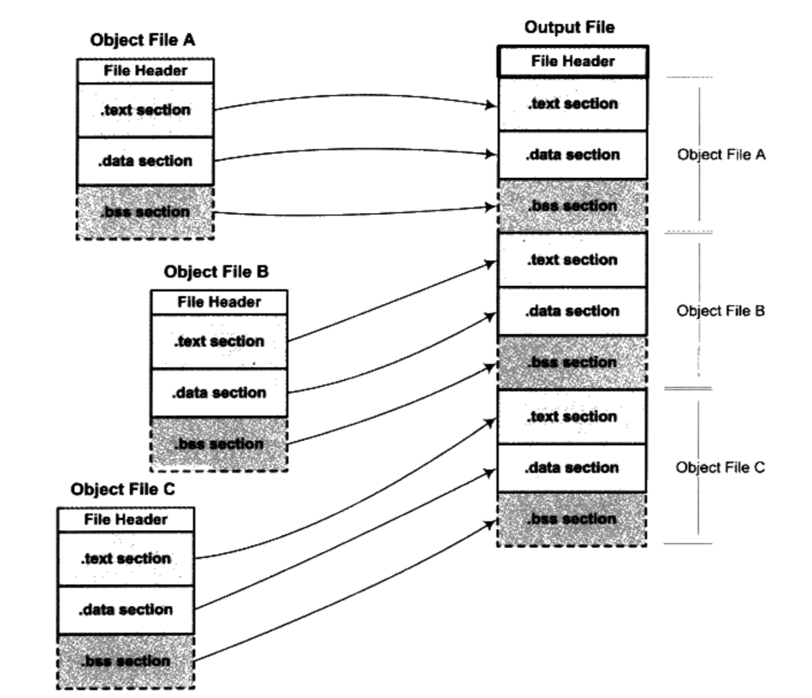
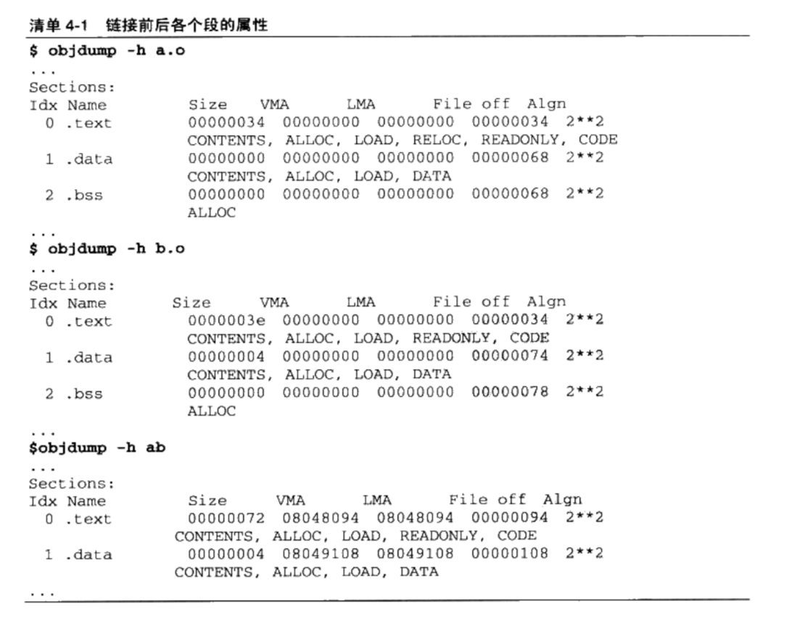
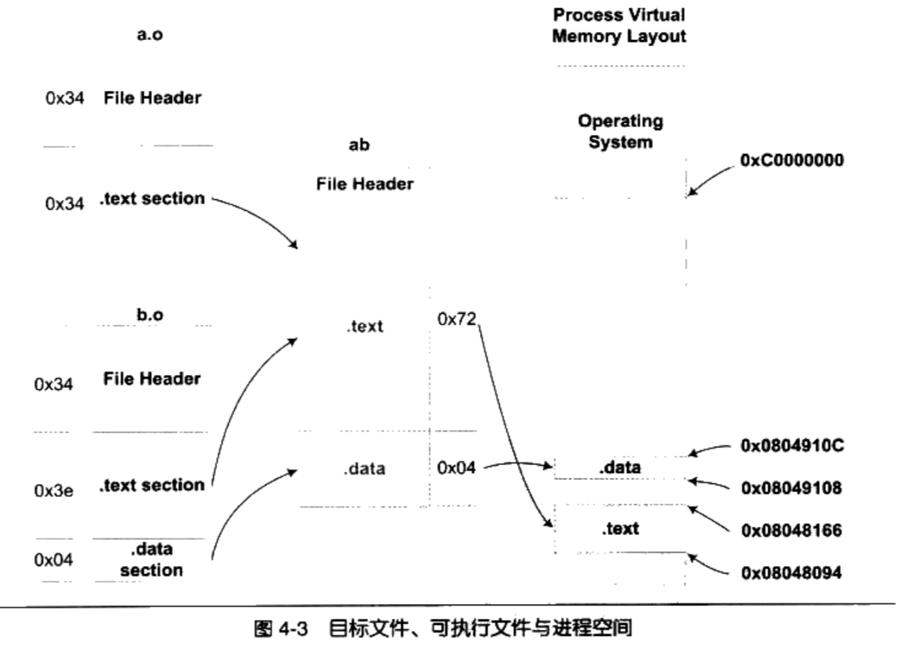
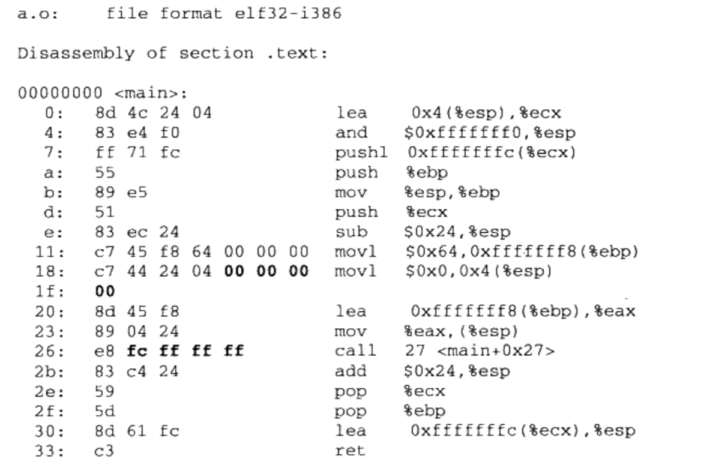

## 静态链接

如何将多个目标文件链接起来，形成一个可执行文件? 链接的核心内容:静态链接

定义两个文件`a.c`, `b.c`

```c
/* a.c */                        
extern int shared;
int main() {
  int a = 100;
  swap(&a, &shared);
}

/* b.c */
int shared = 1;
void swap(int *a, int *b) {
   *a ^= *b ^= *a ^= *b
}
```

1. 将两个源文件编译后，形成目标文件a.o, b.o 。
2. “b.c”总共定义了两个全局符号,一个是变量“ shared”,另外一个是函数“swap”
3. “a,c”里面定义了一个全局符号就是“main”

### 4.1 空间与地址分配

+ 对于链接器来说,整个链接过程中,它就是将几个输入目标文件加工后合并成一个输出文件
+ 链接器如何将它们的各个段合并到输出文件?或者说,输出文件中的空间如何分配给输入文件?

#### 4.1.1 按序叠加

最简单的方案就是将输入的目标文件按照次序叠加起来



+ 在有很多输入文件的情况下,输出文件将会有很多零散的段

+ 这种做法非常浪费空间,因为每个段都须要有一定的地址和空间对齐要求

  ```
  对于x86的硬件来说,段的装载地址和空间的对齐单位是页,也就是4096字节,那么就是说如果一个段的长度只有1个字节,它也要在内存中占用4096字节。这样会造成内存空间大量的内部碎片,所以这并不是一个很好的方案
  ```

#### 4.1.2 相似段合并

更实际的方法是将相同性质的段合并到一起


+ “.bbs”段在目标文件和可执行文件中并不占用文件的空间,但是它在装载时占用地址空间。所以链接器在合并各个段的同时,也将“.bss”合并,并且分配虚拟空间

+ “链接器为目标文件分配地址和空间”这句话中的“地址和空间”其实有两个含义:

  1. 在输出的可执行文件中的空间

  2. 在装载后的虚拟地址中的虚拟地址空间

     ```
     + 对于有实际数据的段,比如“.text”和“.data”来说,它们在文件中和虚拟地址中都要分配空间,因为它们在这两者中都存在
     + 对于“.bss”这样的段来说,分配空间的意义只局限于虚拟地址空间,因为它在文件中并没有内容
     + 事实上,我们在这里谈到的空间分配只关注于虚拟地址空间的分配,因为这个关系到链接器后面的关于地址计算的步骤,而可执行文件本身的空间分配与链接过程关系并不是很大
     ```

+ 链接器空间分配的策略基本上都采用上述方法中的第二种,使用这种方法的链接器一般都采用一种叫两步链接( Two-pass Linking)的方法

  + 第一步: 空间与地址分配

    ```
    1. 扫描所有的输入目标文件,并且获得它们的各个段的长度属性和位置
    2. 将输入目标文件中的符号表中所有的符号定义和符号引用收集起来,统放到一个全局符号表
    3. 通过上面的过程, 链接器将能够获得所有输入目标文件的段长度,并且将它们合并,计算出输出文件中各个段合并后的长度与位置,并建立映射关系
    ```

  + 第二步: 符号解析与重定位

    ```
    1. 使用上面第一步中收集到的所有信息,读取输入文件中段的数据、重定位信息,并且进行符号解析与重定位、调整代码中的地址等
    2. 事实上第二步是链接过程的核心,特别是重定位过程
    ```

+ a.o和b.o链接成可执行文件的过程

  ```
  $ ld a.o b.o -e main -o ab
  
  -e main 表示将main函数作为程序的入口。ld默认的程序入口为_start。
  -o ab   表示链接输出文件名为ab, 默认为a.out。
  ```

  

  1. VMA表示 Virtual Memory Address,即虚拟地址,LMA表示 Load Memory Address即加载地址

     ```
     正常情况下这两个值应该是一样的,但是在有些嵌入式系统中,特别是在那些程序放在ROM的系统中时,LMA和VMA是不相同的。这里我们只要关注VMA即可。
     ```

  2. 链接后程序使用的地址已经是在程序在进程中的虚拟地址了。

  3. 因此我们关心上面各个段中的VMA( Virtual Memory Address)和Size,而忽略文件偏移(File off)。

     ```
     1. 在链接之前,目标文件中的所有段的ⅤMA都是0,因为虚拟空间还没有被分配,所
     以它们默认都为0
     2. 链接之后,可执行文件“ab”中的各个段都被分配到了相应的虚拟地址
     ```

  4. 整个链接过程前后,目标文件各段的分配、程序虚拟地址如下图

     

     + “a.o”和“bo”的代码段被先后叠加起来,合并成“ab”的一个.text段,加起来的长度为0x72

#### 4.1.3 符号地址的确定

1. 在第一步的扫描和空间分配阶段时,链接器将目标文件按照相似段合并后，输入文件中的各个段在链接后的虚拟地址就已经确定了

2. 然后链接器开始计算各个符号的虚拟地址，因为各个符号在段内容的地址是相对固定的。所以链接器须要给每个符号加上一个相对于对应段的偏移量,使它们能够调整到正确的虚拟地址。

   ```
   从前面“objdump”的输出看到,“main”位于“a.o”的“.text”段的最开始,也就是偏移为0,所以“main”这个符号在最终的输出文件中的地址应该是0x08048094+0,即0x08048094
   ```

​     

### 4.2 符号解析和重定位

#### 4.2.1 重定位

>  在a.o中是怎样使用shared，swap这两个外部指令的。

##### 4.2.1.1 重定位前

通过objdump中的-d参数查看a.o的反汇编结果

```shell
$ objdump -d a.o
```



1. 在未进行前面提到过的空间分配之前,目标文件代码段中的起始地址以0x0000000开始,等到空间分配完成以后,各个函数才会确定自己在虚拟地址空间中的位置
2. main函数总共由于17条指令组成，偏移为0x18的mov指令，总共8个字节。前4个字节是指令，后面4个字节为shared的地址，此时为0x0000000
3. 偏移为0x26的call指令，总共5个字节。第一个字节是指令，后面4个字节为swap的地址，此时为0xFFFFFFFC，这也是一个假的地址，因为编译的时候是不知道swap的地址的

##### 4.2.1.2 重定位后

- 编译器把把真正的地址计算工作留给了链接器

- 通过前面的空间与地址分配可以得知,链接器在完成地址和空间分配之后就已经可以确定所有符号的虚拟地址了

- 那么链接器就可以根据符号的地址对每个需要重定位的指令进行地址修正

- 用 objdump来反汇编输出程序“ab”的代码段,可以看到main函数的两个重定位入口都已经被修正到正确的位置

  

  ```
  经过修正以后,“ shared”和“swap”的地址分别为0x08049108和0x00000009
  ```

#### 4.2.2 重定位表

+ 链接器是通过重定位表知道哪些指令是要被调整，以及这些指令怎么调整。

+ 重定位表( Relocation Table)是可重定位的ELF文件中一个或多个段(也叫重定位段)，专门用来保存与重定位相关的信息

  ```
  1. 比如代码段“text”如有要被重定位的地方,那么会有一个相对应叫“.rel.text”的段保存了代码段的重定位表;
  2. 如果代码段“data”有要被重定位的地方,就会有一个相对应叫“.rel.data”的段保存了数据段的重定位表
  ```

+ 使用objdump来查看a.o的重定位表

  ```shell
  $ objdump -r a.o
  ```

  

  + 可以看到“a.o”里面有两个重定位入口

  + 重定位入口的偏移( Offset)表示该入口在要被重定位的段中的位置

  + “ RELOCATION RECORDS FOR [.tex]”表示这个重定位表是代码段的重定位表

  + 对照前面的反汇编结果可以知道,这里的0x1c和0x27

    分别就是代码段中“shared”和“swap”的地址

  + `重定位表是一个Elf32_Rel结构的数组`,每个数组元素对应一个重定位入口

    ```
    typedef struct {
       Elf32_Addr r_offset; //重定位入口在对应段中的偏移
       Elf32_Word r_info;   //重定位入口的类型和符号
    } Elf32_Rel;
    ```

    

#### 4.2.3 符号解析

+ 重定位过程也伴随着符号的解析过程,每个目标文件都可能定义一些符号,也可能引用到定义在其他目标文件的符号

+ 重定位的过程中,每个重定位的入口都是对一个符号的引用,那么当链接器须要对某个符号的引用进行重定位时,它就需要确定这个符号的目标地址。

+ 这时候链接器就会去查找由所有输入目标文件的符号表组成的`全局符号表`,找到相应的符号后进行重定位

+ 查看a.o的符号表

  ```
  $ readelf -s a.o
  ```

  

  1. “ GLOBAL”类型的符号,除了“main”函数是定义在代码段之外,其他两个“ shared和“swap”都是“UND”,即“ undefined”未定义类型
  2. 这种未定义的符号都是因为该目标文件中有关于它们的重定位项
  3. 所以在链接器扫描完所有的输入目标文件之后,所有这些未定义的符号都应该能够在全局符号表中找到,否则链接器就报符号未定义错误

#### 4.2.4 指令修正方式

+ 不同的处理器指令对于地址的格式和方式都不一样
+ 寻址方式:
  1. 近址寻址或远址寻址
  2. 绝对寻址或相对寻址
  3. 寻址长度为8位、16位、32位或64位
  4. 绝对近址32位寻址
  5. 相对近址32位寻址

### 4.3 COMMON块