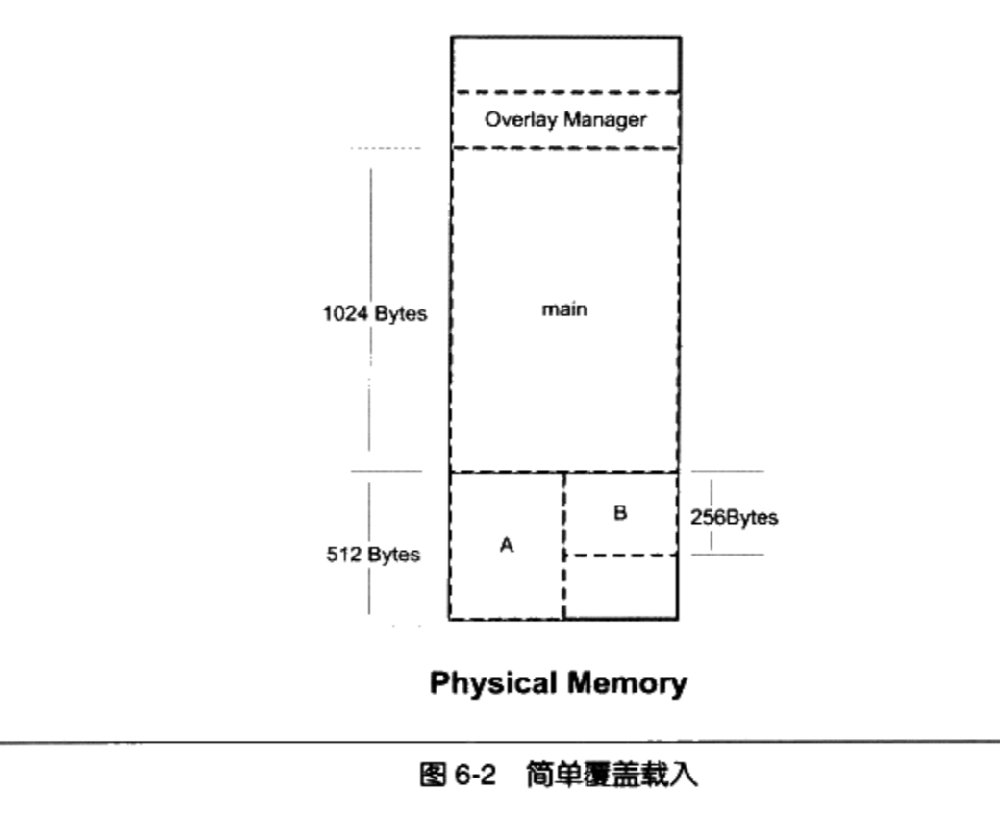
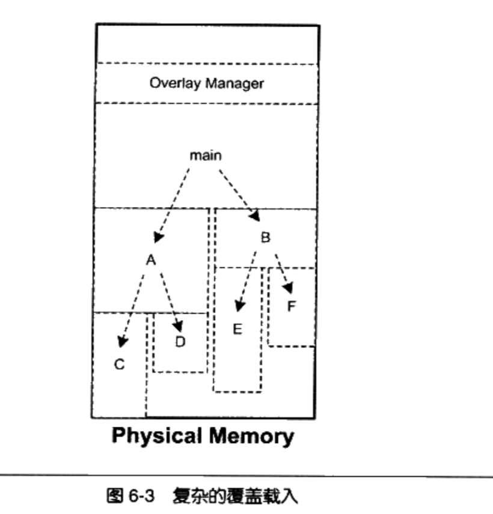

## 可执行文件的装载与进程

可执行文件只有装载到内存以后才能被CPU执行。

### 6.1 进程虚拟地址空间

+ 程序和进程的区别

  1. 程序(或者狭义上讲可执行文件)是一个静态的概念,它就是一些预先编译好的指令和数据集合的一个文件
  2. 进程则是一个动态的概念,它是程序运行时的一个过程,很多时候把动态库叫做运行时( Runtime)也有一定的含义

+ 程序被运行起来以后,它将拥有自己独立的虚拟地址空间( Virtual Address

  Space)

+ 虚拟地址空间的大小由计算机的硬件平台决定,具体地说是由CPU的位数决定的。

  ```
  1. 硬件决定了地址空间的最大理论上限,即硬件的寻址空间大小
  2. 32位的硬件平台决定了虚拟地址空间的地址为0到2^32-1,即为4GB
  3. 64位的硬件平台具有64位寻址能力,即为0奥2^64-1，为17179869184GB
  ```

+ 从程序的角度，c语言指针所占的位数和虚拟空间的位数相同

+ 操作系统为了达到监控程序运行等一系列目的,进程的虚拟空间都在操作系统的掌握之中

+ 进程只能使用那些操作系统分配给进程的地址,如果访问未经允许的空间,那么操作系统就会捕获到这些访问,将进程的这种访问当作非法操作,强制结束进程

+ Linux操作系统中，虚拟地址的空间分配

  

  1. 操作系统本身用了1GB:从地址0xC000000到0XFFFFFFFF,共1GB。剩下的从0x000000址开始到0xBFFFFFFF共3GB的空间都是留给进程使用的
  2. 进程并不能完全使用这3GB的虚拟空间,其中有一部分是预留给其他用途的

+ 对于 Windows操作系统来说,它的进程虚拟地址空间划分是操作系统占用2GB,那么

  进程只剩下2GB空间。但可以修改为操作系统占用1GB, 进程占3GB。

##### 6.1.1 PAE 

+ 32位虚拟空间地址是4GB，这个是无法改变的。

+ 但从硬件层面上来讲,将原先的32位地址先扩展至36位地址线之后, Intel修改了页映射的方式,使得新的映射方式可以访问到更多的物理内存(64G)。 Intel把这个地址扩展方式叫做PAE( Physical Address Extension)。

  ```
  一个应用程序中0x10000000x2000000一段256MB的虚拟地址空间用来做窗口,
  程序可以从高于4GB的物理空间中申请多个大小为256MB的物理空间,编号成A、B、C
  等,然后根据需要将这个窗口映射到不同的物理空间块,用到A时将0x1000000
  0x2000000映射到A,用到B、C时再映射过去,如此重复操作即可
  
  在 Windows下,这种访问内存的操作方式叫做AWE( Address windowing Extensions)
  在Linux等类unix操作系统则采用mmap()系统调用来实现。
  ```

### 6.2 装载方式

+ 程序执行时所需要的指令和数据必须在内存中才能够正常运行,所以最简单的方法是直接把程序整个载入内存。但是很多时候物理内存是不够，扩展更大的内存代价又是昂贵的。

+ 人们发现程序运行时是有局部性原理的,所以将程序最常用的部分驻留在内存中,而将一些不太常用的数据存放在磁盘里面,这就是`动态装入的基本原理`

+ `覆盖载入(Overlay)`和`页映射(Paging)`是两种典型的载入方法
+ 动态装入的思想是程序用到哪个模块,就将哪个模块装入内存,如果不用就暂时不装入,存放在磁盘中。

#### 6.2.1 覆盖载入

+ 覆盖装入在没有发明虚拟存储之前使用比较广泛,现在已经几乎被淘汰了

+ 程序员在编写程序的时候需要手工将程序分割成若干块，然后编写一个小的辅助代码()来管理这些模块何时应该驻留内存而何时应该被替换掉。

+ 这个小的辅助代码就是所谓的覆盖管理器( Overlay Manager)

+ 例如main模块会调用A,B模块。但A,B模块不会互相调用。整个程序需要1792个字节

  

  1. 当main调用A时将A载入。当main调用B时将B载入覆盖A。所以整个程序只需要1536个字节
  2. 覆盖管理器比较小，一般是数十到数百个字节，常驻内存

+ 真实的项目比较复杂，序员需要手工将模块按照它们之间的调用依赖关系组织成树状结构

  

  + 这个树状结构中从仼何一个模块到树的根(也就是main)模块都叫调用路径

    ```
    当该模块被调用时,整个调用路径上的模块必须都在内存中。比如程序正在模块E中执行代
    码,那么模块B和模块mai必须都在内存中,以确保模块E执行完毕以后能够正确返回至模块B和模块main
    ```

  + 禁止跨树间调用

    ```
    任意一个模块不允许跨过树状结构进行调用。比如上面例子中,模块A不可以调用模块B、E、F;模块C不可以调用模块D、B、E、F等。因为覆盖管理器不能够保证跨树间的模块能够存在于内存中。不过很多时候可能两个子模块都需要依赖于某个模块,比如模块E和模块C都需要另外一个模块G,那么最方便的做法是将模块G并入到main模块中,这样G就在E和C的调用路径上了。
    ```

#### 6.2.2 页映射

+ 页映射是虚拟存储机制的一部分，它随着虚拟存储的发明而诞生。